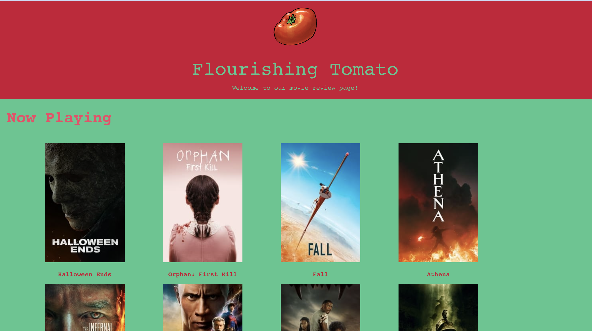
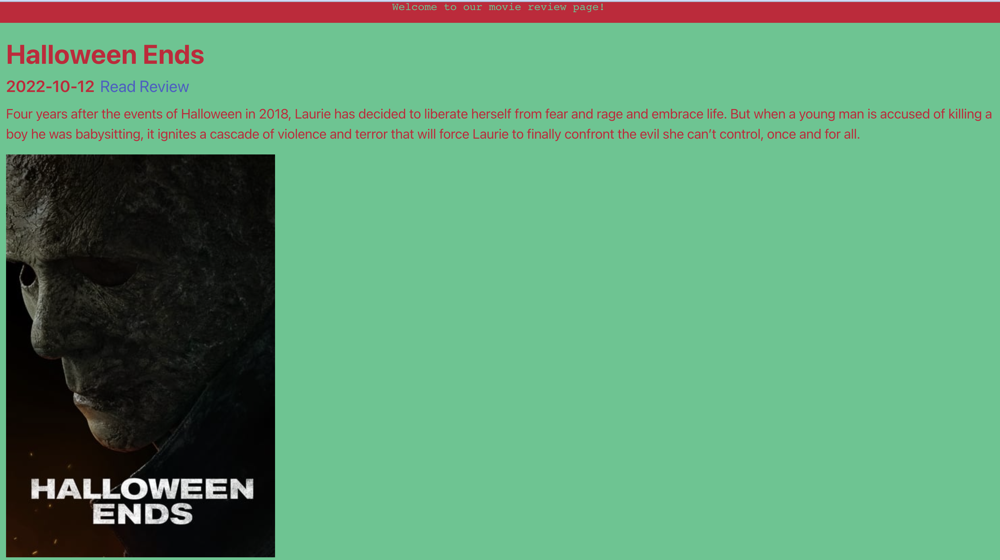

# Flourishing-Tomato

## Description

A web application designed for publishing reviews and ratings for movies you watch. 

- We took inspiration from Rotten Tomato.
- We built this website to become more accessible.
- We learned how to use API's. 
- Are you having trouble finding a good movie to watch? Well Flourishing Tomato can help you fix that problem by giving you the top 20 movies in the world and providing reviews with it.

## Usage

Navigate to the website and scroll through to see the movies you wanna find.

Clicking on the Movie/Title will bring you to a separate webpage with further details.

Link to Live Website:

https://hafeezarif.github.io/Flourishing-Tomato/ 

## Credits
Hafeezarif
Tyreseking
Matheusmoura2000

## License

Refer to GitHub for license

## Features

- You are able to access movie posters and reviews

